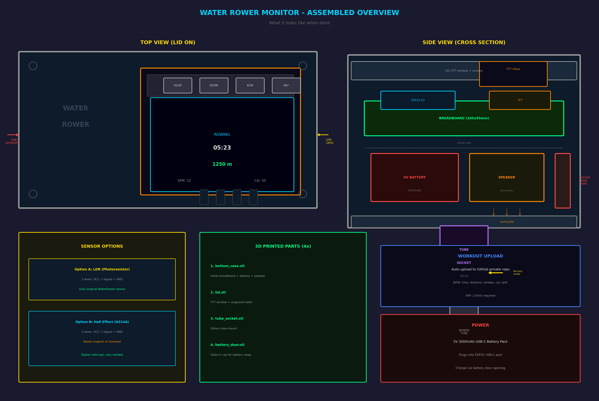

# Water Rower Monitor

Touchscreen replacement console for WaterRower machines, built on a Waveshare
ESP32-S3-Touch-LCD-2.8. The original monitor was destroyed by leaking batteries —
this project replaces it with modern hardware and adds WiFi workout logging.

## Overview



> The photo above shows the earlier breadboard build. The current build is a
> single Waveshare board — see [WIRING.md](WIRING.md) for what it looks like now.

## Features

- Real-time display: time, distance, split/500m, stroke rate, calories
- 2.8" 240×320 IPS colour LCD with **capacitive touch** — no physical keys
- Onboard I2S speaker for audio feedback (start/stop/tap/upload sounds)
- Supports **two sensor types** — choose in config.h:
  - **Blocker**: original WaterRower optical interrupter (no modifications needed)
  - **Hall**: A3144 hall effect sensor + magnet on flywheel
- BLE FTMS broadcast — pairs with Zwift, Kinomap, EXR and other rowing apps
- Automatic workout upload to a TrueNAS share as JSON
- Workout history browsing (last 10 sessions)
- Per-user weights for calorie estimation, admin menu with on-screen keypad
- Runs off an external USB power bank, which also supplies the sensor's 5V
- 3D printable enclosure

## Hardware

| Component | Details |
|-----------|---------|
| Board | [Waveshare ESP32-S3-Touch-LCD-2.8](https://www.waveshare.com/wiki/ESP32-S3-Touch-LCD-2.8) (ESP32-S3R8, 16 MB flash, 8 MB PSRAM) |
| Display | ST7789 2.8" 240×320 IPS, SPI — onboard |
| Touch | CST328 capacitive, I2C — onboard |
| Audio | PCM5101 I2S DAC + amplifier + 8Ω 2W speaker — onboard |
| Sensor | Optek OPB365T55 optical interrupter (original 3-wire) **or** Hall (A3144 + magnet) |
| Power | External USB power bank (2× 18650) into USB-C — strapped to the rower arm, not inside the case |
| Mount | 18mm tube socket (fits original WaterRower arm) |

Everything except the sensor is already wired on the board. The only cable you
run is the sensor's three wires to the 12PIN header.

The board's IMU (QMI8658), RTC (PCF85063), TF card slot and battery gauge are
present but unused by this firmware — free for future additions.

## Wiring

Three wires, and one power caveat worth reading before you build:

| Sensor wire | Goes to | Note |
|-------------|---------|------|
| Red (VCC) | 12PIN `VBus` (5V) | 3.3V is too dim for the IR LED |
| Green (GND) | 12PIN `GND` | |
| Blue (SIG) | 12PIN `IO18` | digital, LOW when blocked |

`VBus` carries the 5V coming in over USB-C, so running the whole thing off an
external USB power bank feeds the sensor for free — no boost converter, no
onboard charger, no battery inside the case.

> ⚠️ The one thing to verify: many power banks **cut off automatically** below
> ~50-70 mA. This build draws roughly 150-250 mA so it normally stays awake, but
> test yours before trusting it — see [APPLY.md](APPLY.md).

> ⚠️ If you ignore the power-bank route and wire a cell to the board's MX1.25
> connector instead, it must be a **single 3.7 V cell (1S)**. A 7.4 V 2S pack
> destroys the onboard charger and the MCU, and JST 1.25 leads are not wired
> consistently between vendors — check polarity with a meter first.

## Assembly

See [APPLY.md](APPLY.md) for the step-by-step build: what to buy, what to
measure before printing, wiring, flashing, and the first-boot self-test.

## Controls

Fully touch-driven — the board has no user keys.

| Screen | Actions |
|--------|---------|
| Idle | `START` · `HISTORY` · `−`/`+` brightness · **hold the title bar 3 s for admin** |
| User select | Tap a name to select, `START` to begin; swipe up/down to scroll |
| Rowing | `PAUSE` |
| Paused | `RESUME` · `FINISH` (saves + uploads) |
| History | `PREV` / `NEXT`, or swipe up/down |
| Admin | On-screen numeric keypad; `DEL` backspace, `ESC` cancel |

## Setup

1. Copy the config template:
   ```bash
   cp firmware/include/config.h.example firmware/include/config.h
   ```

2. Edit `firmware/include/config.h` with your:
   - WiFi networks (`WIFI_SSIDS` / `WIFI_PASSWORDS`)
   - TrueNAS host, API key and target path
   - User names, machine serial
   - Sensor type: `SENSOR_TYPE_BLOCKER` or `SENSOR_TYPE_HALL`

3. Create the target directory on your TrueNAS share

4. Flash the firmware (USB-C goes straight to the S3's native USB — no UART
   bridge, so the serial monitor rides on USB CDC):
   ```bash
   cd firmware && pio run -t upload
   ```

5. Export STL files from `enclosure/enclosure.scad` using OpenSCAD (F6 → F7)

## 3D Printed Parts

| Part | File | Description |
|------|------|-------------|
| Bottom case | `bottom_case.stl` | Holds the board, speaker and sensor cable |
| Lid | `lid.stl` | Screen window + engraved label |
| Tube socket | `tube_socket.stl` | 18mm mount for WaterRower arm |

Finished size is 74.9 × 94.0 × 18.7 mm — there is no battery door because the
power bank stays outside.

Board geometry comes from Waveshare's own outline drawing, so the PCB size
(49.90 × 69.00), glass size (50.54 × 73.06) and the 41 × 60 mm mounting hole
pattern are exact rather than guessed. Two consequences shape the design: the
glass **overhangs the PCB on every edge**, so nothing clamps the board's edges —
it hangs on four M2.5 posts — and every connector is on the back, so the lid
needs no cutouts at all.

Three values still need confirming against the real board before printing the
lid: `pcb_screw_d` (the drawing omits hole diameter), `glass_off_y` (derived
from the drawing's 1.9 mm callout) and `usb_edge_off`.

## Workout Data

Each workout is saved as JSON to your TrueNAS share:

```json
{
  "machine_sn": "132224",
  "machine_model": "Water Rower USA",
  "date": "2026-04-02T18:30:25Z",
  "user": "Alice",
  "duration_sec": 1800,
  "distance_m": 6500,
  "strokes": 450,
  "calories": 260,
  "split_500m": "2:18"
}
```

Guest sessions are shown on screen and broadcast over BLE, but not uploaded.

## Calibration

1. Power on — the idle screen shows the live sensor state (`clear` / `BLOCKED`)
2. Block the interrupter by hand and confirm the state flips
3. Row 10 strokes, compare the displayed distance to the actual one
4. Hold the title bar 3 s → `Calibration`, adjust `METERS_PER_PULSE`:
   `new = current × (actual distance / shown distance)`
5. `SAVE` — the value is stored in NVS and survives power cycles

## License

[MIT](LICENSE)
